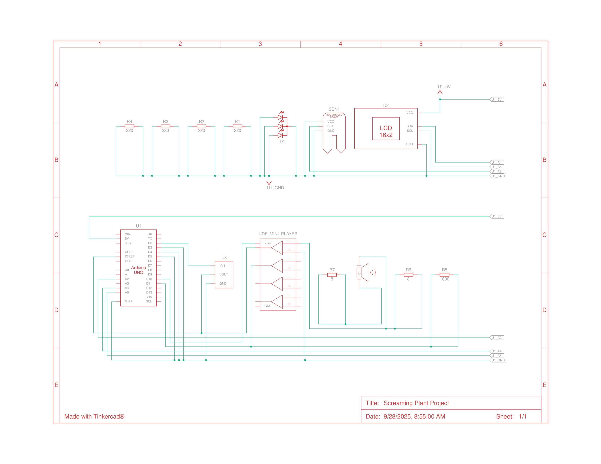
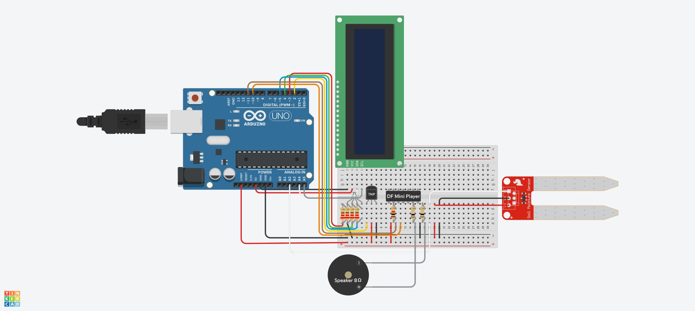

# 🌱 Arduino Screaming Plant Project  

A fun Arduino project where your plant can “scream,” “beg,” or “sing” based on its soil moisture level.  
It uses a moisture sensor, LCD display, RGB LEDs, and a DFPlayer Mini with a speaker to give your plant a personality.  

 
 
.  

---

## 🛠 Technologies Used  
- **Arduino Uno**  
- **DFPlayer Mini MP3 Player** + Speaker  
- **LiquidCrystal_I2C** (16x2 LCD)  
- **Soil Moisture Sensor**  
- **RGB LED** (or 3 LEDs with resistors)  
- **Arduino IDE**  

---

## 🚀 Getting Started  

### Hardware Setup  
- Arduino Uno board  
- Moisture Sensor → `A2`  
- DFPlayer Mini → `D10` (RX), `D11` (TX), `SPK_1/SPK_2` → Speaker  
- LCD I2C → `SDA/SCL`  
- RGB LED → `D3` (Red), `D4` (Green), `D5` (Blue), each with 220Ω resistor  

### Software Setup  
1. Install Arduino IDE.  
2. Install required libraries:  
   - `LiquidCrystal_I2C`  
   - `DFRobotDFPlayerMini`  
3. Format microSD card to **FAT32**, place MP3s:  
   - 0001.mp3
   - 0002.mp3
   - 0003.mp3
   - 0004.mp3
4. Upload code to Arduino Uno.  

---

## 🎮 Usage  
1. Insert moisture sensor into soil.  
2. Power Arduino Uno via USB or 5V supply.  
3. Watch LCD messages, LED mood changes, and listen to plant “screams.”  

---
## 📂 Project Structure  
```
Arduino-Screaming-Plant/
├── screaming_plant.ino        # Main Arduino sketch
│
├── assets/
│   ├── audio/
│   │   ├── 0001.mp3               # Dry alert (variation 1)
│   │   ├── 0002.mp3               # Dry alert (variation 2)
│   │   ├── 0003.mp3               # Dry alert (variation 3)
│   │   └── 0004.mp3               # Water received sound
│   └── images/
│       └── wiring_diagram.png     # Fritzing or circuit wiring diagram
│
├── docs/
│   ├── README.md                  # Main project documentation
│   └── changelog.md               # Version history
│
├── .gitignore
└── LICENSE
```

---

## 📦 Packaging for Distribution  
- Share `.ino` file inside `/src`.  
- Provide `sounds/` folder with MP3 samples.  
- Document hardware wiring diagram (optional Fritzing).  

---

## 🔮 Future Enhancements  
- Add **temperature sensor (DHT11/LM35)** → plant complains if too hot/cold.  
- WiFi/IoT support with ESP8266 → send plant tweets when thirsty.  
- Mobile app integration for remote monitoring.  
- More MP3 sounds (Mario theme, Zelda chimes, etc.).  
- 3D-printed enclosure to make it look like a flowerpot gadget.  

---

## 📝 Changelog  
- **v1.0** — Initial release with LCD, RGB LED, DFPlayer Mini, and soil moisture sensor.  

---

## 💻 System Requirements  
- Arduino Uno (or compatible)  
- 32 GB or smaller microSD card (FAT32)  
- Arduino IDE 1.8+ or Arduino IDE 2.x  

---

## 🐞 Troubleshooting  
- **No sound?** → Check DFPlayer wiring (cross RX/TX), ensure microSD is FAT32 with correct file names (`0001.mp3`).  
- **LCD not showing?** → Verify I2C address (try `0x27` or `0x3F`).  
- **LED not lighting?** → Check resistors and confirm pins support PWM (`D3`, `D5`).  
- **Moisture always 0%/100%?** → Recalibrate `wet` and `dry` values in code.  

---

## 🙏 Acknowledgements  
- [DFRobotDFPlayerMini Library](https://github.com/DFRobot/DFRobotDFPlayerMini)  
- Arduino community tutorials for inspiration.  
- Open-source spirit 🌍.  
- Nooby 
- Firelink
- SBBC PC
- Rita's PC
- To my dog and cat

---

## 📜 License  
MIT License. See `LICENSE` for details.  

---
